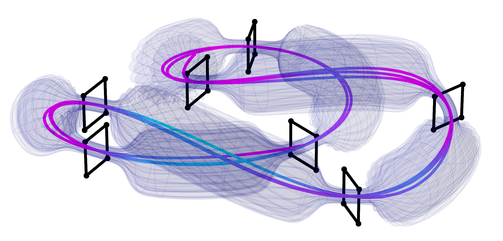
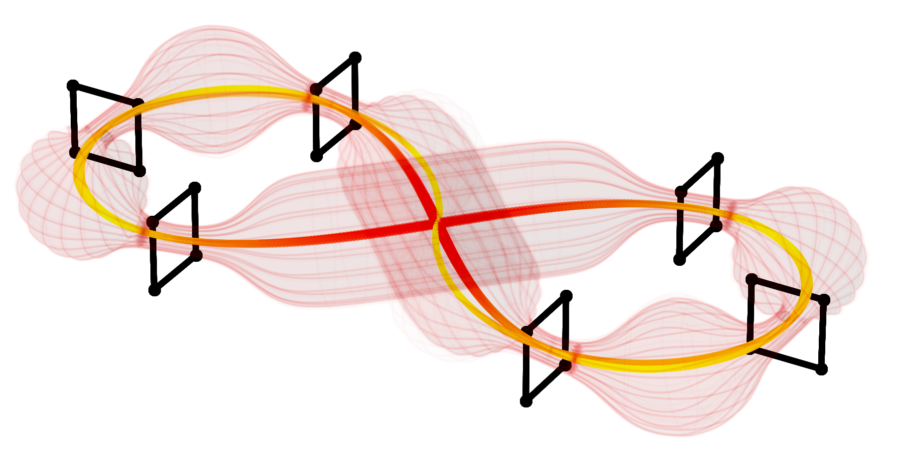
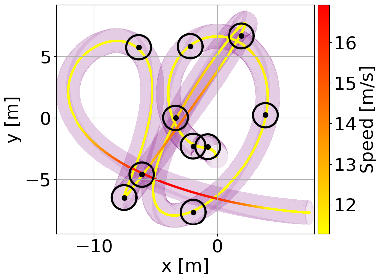

# Run-TOGT-Planner

<table>
  <tr>
    <td style="width:50%;"></td>
    <td style="width:50%;"></td>
  </tr>
</table>

This Python package provides an interface to run the [**Time-Optimal Gate-Traversing (TOGT) Planner**](https://github.com/FSC-Lab/TOGT-Planner), originally a C++ project.

With this package, you can generate random racetracks and plan paths using the **TOGT Planner**. It supports looping to generate a large number of high-quality trajectories that prioritize dynamic feasibility.

## Installations

#### 1. Clone TOGT-Planner

```bash
git clone https://github.com/FSC-Lab/TOGT-Planner.git
cd TOGT-Planner/
git checkout f69f3fc9143b02b58bd6a66dc12a531395bf5317
```

**Note:** Please check out to the commit from **May 15, 2024** (commit `f69f3fc9143b02b58bd6a66dc12a531395bf5317`, [Correct plotting bugs](https://github.com/FSC-Lab/TOGT-Planner/commit/f69f3fc9143b02b58bd6a66dc12a531395bf5317)) for a stable version.

#### 2. Clone the Repository and install the package

```bash
cd ${YOUR_TOGT_PLANNER_PATH}
git clone https://github.com/KafuuChikai/Run-TOGT-Planner.git
cd Run-TOGT-Planner/
```

It is recommended to use **Conda** to create a virtual environment. *If you do not use Conda, ensure Poetry is installed.*

```bash
conda create -n togt_env python=3.8
conda activate togt_env
```

**Install the package**

```bash
pip install --upgrade pip
pip install -e .
```

#### 3. Modify `CMakeLists.txt`

Add the following code after line 247:

```cmake
add_executable(planners Run-TOGT-Planner/traj_planner/traj_planner_togt.cpp)
target_compile_options(planners PRIVATE
  -fno-finite-math-only
  -Wall                   # Show all warnings
  -Wextra                 # Show extra error information
  -Wpedantic              # Issue all the warnings demanded by strict ISO C and ISO C++
  -Werror                 # Raise all warnings to errors
  -Wunused                # Warn whatever is assigned to, but unused
  -Wno-unused-parameter
  -Wundef                 # Warn if an undefined identifier is evaluated in an #if directive. 
  -Wcast-align            # Warn whenever a pointer is cast such that the required alignment of the target is increased
  -Wmissing-declarations  # Warn if a global function is defined without a previous declaration
  -Wmissing-include-dirs  # Warn if a user-supplied include directory does not exist.
  -Wnon-virtual-dtor      
  -Wredundant-decls       # Warn if anything is declared more than once in the same scope
  -Wodr
  -Wunreachable-code
  -Wno-unknown-pragmas
)
target_link_libraries(planners
        ${LIBRARY_NAME}
        $<$<AND:$<CXX_COMPILER_ID:GNU>,$<VERSION_LESS:$<CXX_COMPILER_VERSION>,9.0>>:stdc++fs>
        )
```

#### 4. Build the Project

Navigate to the **TOGT-Planner** directory, configure the project, and compile:

```bash
cd ${YOUR_TOGT_PLANNER_PATH}/
mkdir build
cd build
cmake ..
make
```

#### 5. Run the Example Script

- Show **predefined trajectory**


```bash
python ${YOUR_TOGT_PLANNER_PATH}/Run-TOGT-Planner/examples/plan_race_example.py
```

- Show **random trajectory**


```bash
python ${YOUR_TOGT_PLANNER_PATH}/Run-TOGT-Planner/examples/random_race_example.py
```

- Show **3D tubes**

```bash
python ${YOUR_TOGT_PLANNER_PATH}/Run-TOGT-Planner/examples/draw_tube.py
```

If you want to learn more, refer to [Tools](#Tools).

## Visualizations

### 1. Predefined trajectory

You can get a predefined trajectory below:

<p>
  
</p>

### 2. Random trajectories

The random trajectory examples:

<table>
  <tr>
    <td style="width:50%;"></td>
    <td style="width:50%;"></td>
  </tr>
</table>

<table>
  <tr>
    <td style="width:50%;"></td>
    <td style="width:50%;"></td>
  </tr>
</table>

<table>
  <tr>
    <td style="width:50%;"></td>
    <td style="width:50%;"></td>
  </tr>
</table>

### 3. 3D trajectories with Tube

**Update**: Plot 3D trajectories and visulize with Tube.

<table>
  <tr>
    <td style="width:50%;"></td>
    <td style="width:50%;"></td>
  </tr>
</table>
<table>
  <tr>
    <td style="width:50%;"></td>
    <td style="width:50%;"></td>
  </tr>
</table>

<table>
  <tr>
    <td style="width:50%;"></td>
    <td style="width:50%;"></td>
  </tr>
</table>


## Tools

1. [RaceGenerator](docs/utils_manual.md#L3)
2. RaceVisualizer